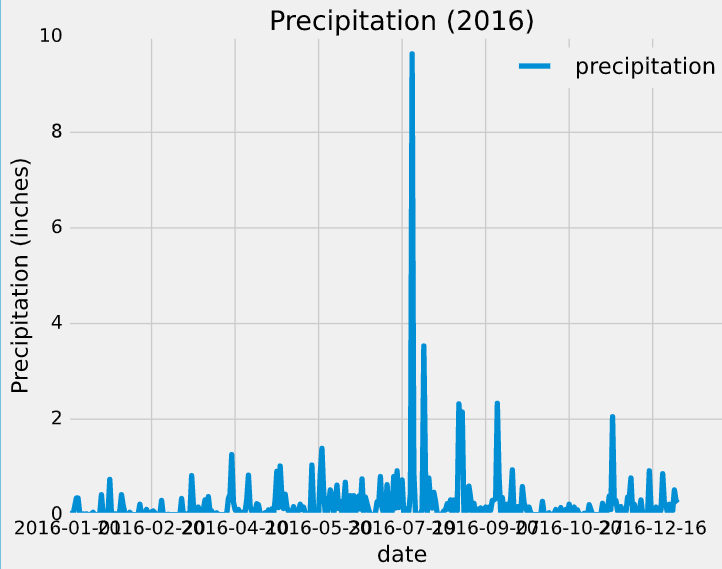
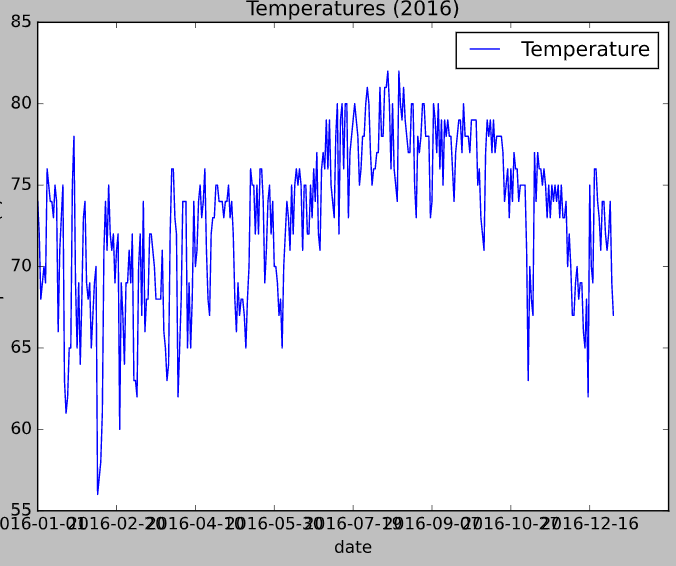

# Surfs Up

## Purpose
   

## Data Source
Weather data was provided by W. Avy in the form of an sqlite file   .

## Deliverables 
1. 
2. 
3.
4. 

## Working Files  

## Data Files 
Located within this GitHub repository:
1. 

----------------------------------------------------------------------------------
### Appendix of Figures and Tables
----------------------------------------------------------------------------------

 
 
### Fig. 1:  Precipitation: 2016 Oahu Island
 
 
 

 
 
### Fig. 2:  Temperature: 2016 Oahu Island
 
 
 
